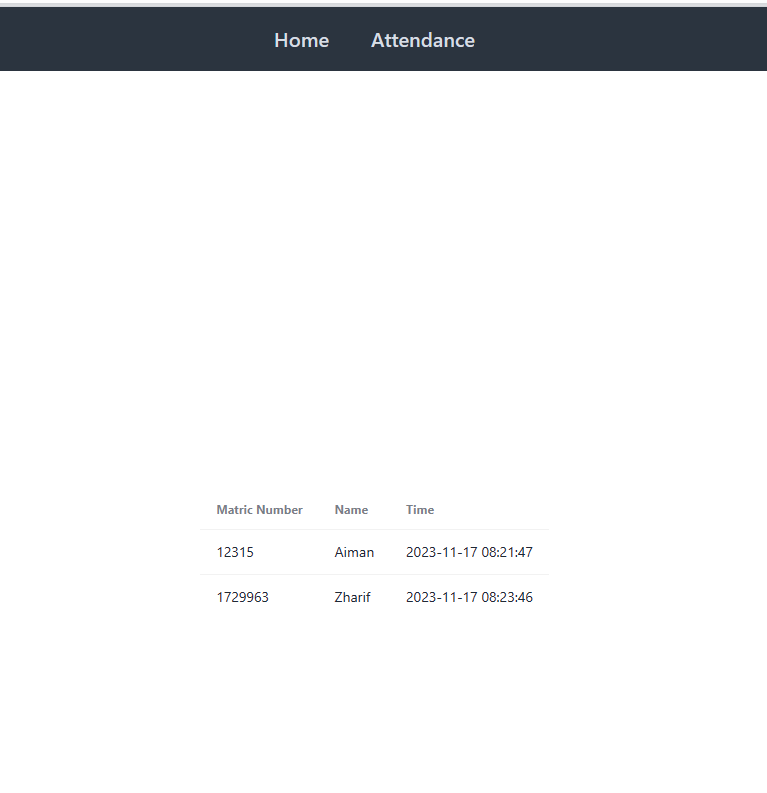
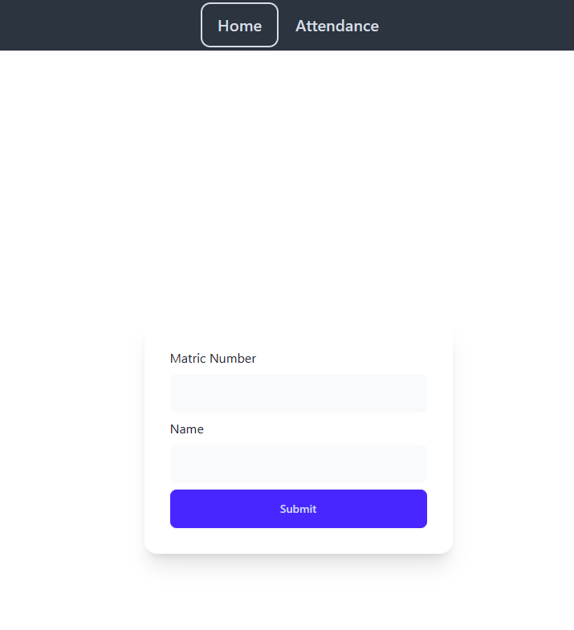

# Hadeer

## Description

Record attendance for students in a class, and see it live on a dashboard.

This is just a test on using SSE (Server Sent Events) with Go.

## Installation

1. Clone the repo
2. run `go mod tidy`
3. run `go run main.go`